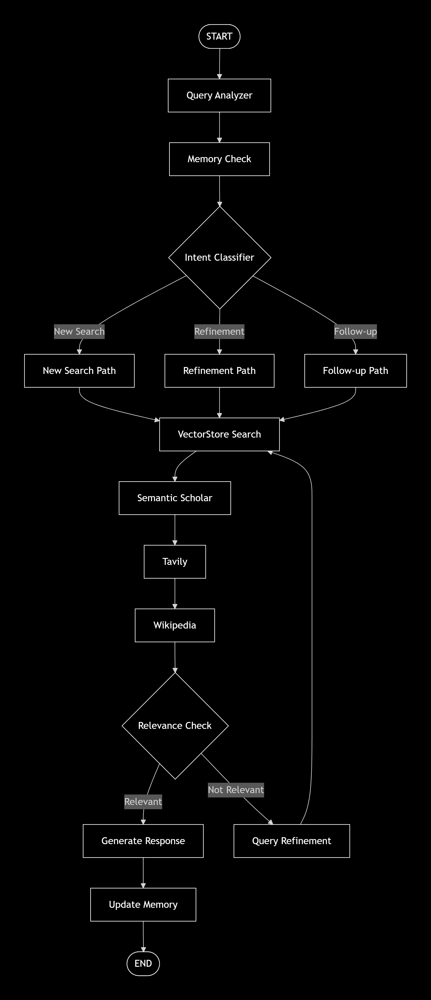

# MentorVerse 🚀

**An Intelligent Faculty Discovery & Research Assistance System**

## Overview

**MentorVerse** is an AI-powered system designed to help users discover faculty members and research expertise across multiple colleges. It combines web scraping, vector-based retrieval, multi-vector indexing, reranking, intent classification, and external scholarly tools to provide accurate and relevant responses to user queries.

The system intelligently understands whether a query is a **new search**, a **refinement**, or a **follow-up**, and dynamically adapts the retrieval and reasoning pipeline accordingly.

---

## Key Features

* Automated faculty data collection from multiple colleges
* Multi-vector semantic retrieval for better context coverage
* Query intent classification (New Search / Refinement / Follow-up)
* Hybrid research enrichment using external knowledge sources
* Relevance-based response validation with iterative query refinement
* Memory-aware interactions for improved follow-up handling

---

## Data Collection

Faculty data is scraped using **BeautifulSoup** from official college and department websites.

### Extracted Information

* Faculty Name
* Designation / Position
* Research Areas
* Publications & Papers
* Institutional Affiliation

The collected data is cleaned and structured before being processed further.

---

## System Architecture & Workflow

### 1. Query Analysis

* User query is analyzed for structure and semantics.
* Prior conversation memory is checked to understand context.

### 2. Intent Classification

The query is classified into one of three categories:

* **New Search** – Fresh query with no dependency on prior context
* **Refinement** – Narrowing or modifying a previous query
* **Follow-up** – Context-dependent continuation

Each intent follows a dedicated processing path.

### 3. Vector-Based Retrieval

* Faculty data is stored in a **vector database**.
* A **Multi-Vector Retriever** is applied to capture different semantic aspects of the same document.
* Results are **re-ranked** to improve relevance.

### 4. External Knowledge Augmentation

If required, results are enriched using:

* **Semantic Scholar** – Academic papers and citations
* **Wikipedia** – Background and contextual knowledge
* **Tavily** – Web-based factual enrichment

### 5. Relevance Check

* Retrieved information is evaluated for relevance.
* If relevance is **high**, a response is generated.
* If relevance is **low**, the system performs **query refinement** and re-enters the retrieval loop.

### 6. Response Generation & Memory Update

* Final response is generated for the user.
* Useful context is stored in memory for better future interactions.

---

## Tech Stack

* **Python**
* **BeautifulSoup** – Web scraping
* **Vector Database (e.g., ChromaDB)**
* **Multi-Vector Retriever**
* **Reranking Models** - Flashrank
* **Semantic Scholar API**
* **Wikipedia API**
* **Tavily Search API**

---

## Use Cases

* Finding faculty members based on research interests
* Discovering potential mentors for research or higher studies
* Exploring academic publications and expertise areas
* Context-aware academic question answering

---

## Project Flow Diagram

The complete system workflow is illustrated in the architecture diagram included in this repository, showing intent routing, retrieval paths, relevance checks, and refinement loops.

